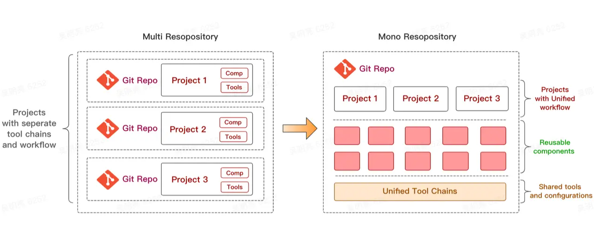
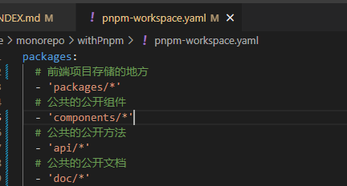
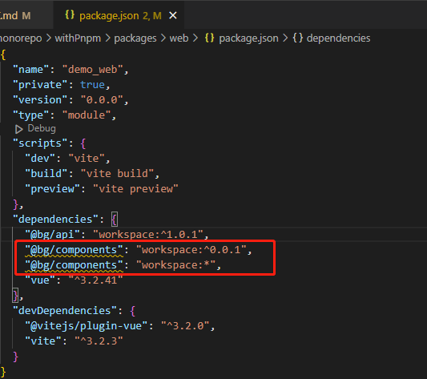
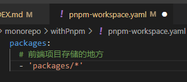

# monorepo
- <a href='#topic1'>关于monorepo</a>
- <a href='#topic2'>monorepo和multirepo</a>　
- <a href='#topic3'>workspaces</a>
- <a href='#topic4'>与pnpm的结合</a>
- <a href='#topic5'>疑问</a>

---

### <a id='topic1' style='text-decoration:none;'>关于monorepo</a>
个人理解就是：用一个大项目A来承载一堆子项目BCD。以前一个项目一个仓库，现在用一个git仓库统一管理全部(有点多页应用的味道)。  
好处就是多了个公共文件夹存放公共内容，比如公共组件、工具方法、配置文件；应用衍生的具体优势就很多比如：  
- 依赖更新方便：我更新A里面的公共组件时候，BCD的引用自然也是最新的了，不用再去一个个更新。  
- 打包配置、代码规范配置等等可以统一。  
- 复用逻辑清晰。  
- 更新代码方便，公共文件更新时候，拉取就行，而不是像以前那样重装依赖。  
- 子应用可以独立部署构建

本质还是模块的抽离再利用。

---

### <a id='topic2' style='text-decoration:none;'>monorepo和multirepo</a>
引用一张两者的对比图      
    
之前传统的方式multirepo当中，每个项目都对应单独的一个代码仓库。用这种方式开发是真切地感受到了这种方式带来的诸多弊端：  
1.代码复用  
在维护多个项目的时候，有一些逻辑很有可能会被多次用到，比如一些基础的组件、工具函数，或者一些配置，之前就把代码直接复制粘贴，但如果这些代码出现bug、或者需要做一些调整的时候，就得修改多份，维护成本越来越高。   
后来比较好的方式是将公共的逻辑代码抽取出来，作为一个`npm`包进行发布，一旦需要改动，只需要改动一份代码，然后`publish`就行了。但又比如项目引入了`1.1.0`版本的`A`包，某个工具函数出现问题了，需要做这些事情：  
- 去修改一个工具函数的代码;  
- 发布1.1.1版本的新包;  
- 项目中安装新版本的`A`;    
  
可能只是改了一行代码，需要走这么多流程。然而开发阶段是很难保证不出bug的，如果有个按钮需要改个样式，又需要把上面的流程重新走一遍，这些重复的步骤真的是必须的吗？只是想复用一下代码，为什么每次修改代码都这么复杂？   
上述的问题其实是`multirepo`模式普遍存在的问题，因为不同的仓库工作区的割裂，导致复用代码的成本很高，开发调试的流程繁琐，甚至在基础库频繁改动的情况下让人体验很差。  
2.版本管理  
在`multirepo`的开发方式下，依赖包的版本管理有时候是一个玄学问题。比如说刚开始一个工具包版本是`v1.0.0`，有诸多项目都依赖于这个工具包，但在某个时刻，这个工具包发了一个问题版本，和原来版本的`API`完全不兼容。而事实上有些项目并没有升级这个依赖，导致一些莫名的报错。  
当项目多了之后，很容易出现这种依赖更新不及时的情况。这又是一个痛点。    
3.项目基建   
由于在`multirepo`当中，各个项目的工作流是割裂的，因此每个项目需要单独配置开发环境、配置`CI/CD`流程、配置部署发布流程等等，甚至每个项目都有自己单独的一套脚手架工具。
其实，很容易发现这些项目里的很多基建的逻辑都是重复的，如果是10个项目，就需要维护10份基建的流程，逻辑重复不说，各个项目间存在构建、部署和发布的规范不能统一的情况，这样维护起来就更加麻烦了。  
而对于`monorepo`模式来说,上述痛点均有医可寻。  
首先是工作流的一致性，由于所有的项目放在一个仓库当中，复用起来非常方便，如果有依赖的代码变动，那么用到这个依赖的项目当中会立马感知到。并且所有的项目都是使用最新的代码，不会产生其它项目版本更新不及时的情况。  
其次是项目基建成本的降低，所有项目复用一套标准的工具和规范，无需切换开发环境，如果有新的项目接入，也可以直接复用已有的基建流程，比如`CI/CD`流程、构建和发布流程。这样只需要很少的人来维护所有项目的基建，维护成本也大大减低。   
再者，团队协作也更加容易，一方面大家都在一个仓库开发，能够方便地共享和复用代码，方便检索项目源码。

---

### <a id='topic3' style='text-decoration:none;'>workspaces</a>
  > 顺着npm link => workspaces => monorepo  

之前开发调试调试都是使用`npm link`链接本地包，`npm`在`V7`版本后引入了多空间`workspaces`的概念。初衷是为了用来进行多包管理的，它可以让多个npm包在同一个项目中进行开发和管理变得非常方便。
- 它会将子包中所有的依赖包都提升到根目录中进行安装，提升包安装的速度；  
- 它初始化后会自动将子包之间的依赖进行关联(软链接)；
- 因为同一个项目的关系，从而可以让各个子包共享一些流程，比如：eslint、stylelint、git hooks、publish flow等；
  原生`npm workspaces`在package.json下进行声明配置，划分项目空间范围： 
      
我们这次直接使用的是`pnpm`内置的`workspaces`，本质理念是一致的，只是配制方式不同。一个`workspace`的根目录下必须有`pnpm-workspace.yaml`文件，也可能会有`.npmrc`文件。`pnpm-workspace.yaml`主要作用是定义了工作空间的根目录，并能够使您从工作空间中包含/排除目录。  
      
在项目里的`package.json`引入`workspace`协议，`pnpm`将拒绝解析除本地`workspace` 包含的`package`之外的任何内容。  
   
本地`workspace`引入可使用版本引入也可以标注*引入。使用`workspace:*`的写法来链接子包，而不是具体的版本号，这可以防止多人协作时因为修改版本的遗漏而发生冲突。

---

### <a id='topic4' style='text-decoration:none;'>与pnpm的结合</a>
`monorepo`和`pnpm`结合使用，`pnpm`由于`symlink`和`hardlink`机制，既极大的缩小了安装包的体积，同时也解决了隐藏依赖的问题，两者十分契合。  
尝试用`pnpm`构建`monorepo`项目：  
在已安装完`.pnpm`的情况下，在目录下init一个项目。在其根目录新建`pnpm-workspace.yaml`，内容如下:
     

---

### <a id='topic5' style='text-decoration:none;'>疑问</a>
1.如果将所有项目整合在一起，是否会存在大家一起做需求，然后频繁地代码冲突问题?  
2.代码的`CD`发布该如何考虑，按照目前了解的是所有子项目都会同步更新，那如果在这个过程中，某个环节出了点小问题，比如某个同事混淆了一些代码，而`review`环节又不够严谨，导致某个工程崩了，那是不是发上去其它工程会有影响？  
3.如果子项目被多个项目引用，项目引用的子项目版本又各不相同，是不是只能在子项目以最高版本的形式进行向下兼容？还是说子项目用分支形式进行版本管理？如果以分支形式管理，那感觉不是很适合业务开发，不同项目业务迭代进度不一样，分支管理容易产生问题；通用组件工具类型的倒是感觉挺合适的。

