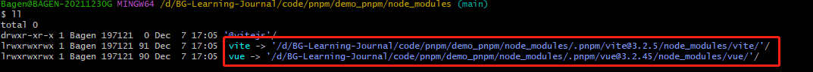
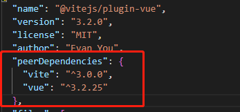
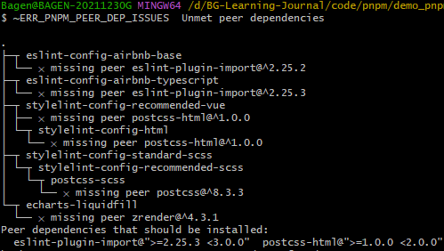
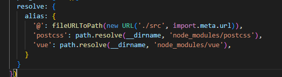
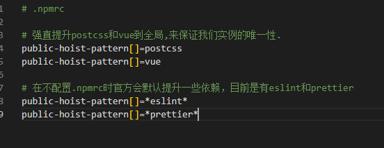
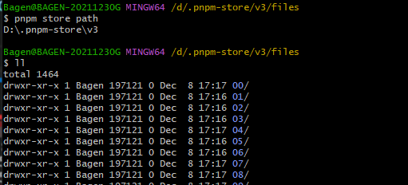
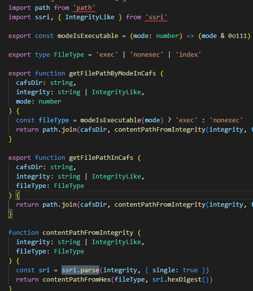
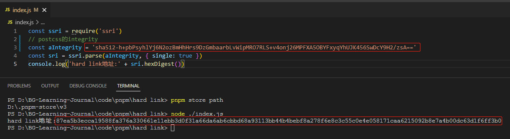

# pnpm
- <a href='#topic1'>区别与npm</a>
- <a href='#topic2'>peerDependencies</a>
- <a href='#topic3'>symbol link和hard link</a>
- <a href='#topic4'>与monorepo的结合</a>

---

### <a id='topic1' style='text-decoration:none;'>区别与npm</a>
1.pnpm可以把依赖包存放在一个统一的位置，区别于npm独立的`node_modules`副本。
 
2.如果对同一依赖包需要使用不同的版本，则仅有版本之间不同的文件会被存储起来。例如，如果某个依赖包含 100 个文件，其发布了一个新版本，并且新版本中只有一个文件有修改，则 `pnpm update` 只需要添加一个新文件到存储中，而不会因为一个文件的修改而保存依赖包的所有文件。
 
3.就单项目而言，pnpm下载的依赖包结构不会和npm下载的一样将所有依赖提升到`node_modules`的根目录下，而是仅将项目的直接依赖项提升到`node_modules`的根目录下，其余的由`.pnpm`文件夹管理，同时根目录下的绝大多数依赖也是通过符号链接形式到`.pnpm`下。

 
npm下载

 
npm根目录追溯`postcss`

 
pnpm下载

 
pnpm根目录追溯`postcss`

 

---

### <a id='topic2' style='text-decoration:none;'>peerDependencies</a>
项目的`package.json`文件内都声明了项目的依赖，其中有三种类型，`dependencies`、`devDependencies`、`peerDependencies`。之前基本上只接触过`dependencies`、`devDependencies`，对`peerDependencies`缺乏认知。
 
`peerDependencies`声明包的同步依赖。但是包管理器不会像`dependencies`一样，自动为用户安装好依赖，当用户使用包时，必须遵照该包的`peerDependencies`同步安装对应的依赖，否则包管理器会提示错误。
 
`peerDependencies`的使用场景一般是核心库的周边插件，例如`vue`中的`vuex`，或者 `vite`之于,`@vitejs/plugin-vue2`，插件一般是不能独立于核心库而单独工作的。例如`@vitejs/plugin-vue2`，作用是解析`vue 2.7及以上版本`的模板文件，因此对`vite`和 `vue`的版本进行了限制。

 
对比于`dependencies`默认自动安装依赖，`peerDependencies`通过安装时的提示信息，可以指导用户正确安装核心依赖，能避免一些依赖版本冲突。

 但是对于pnpm的`peerDependencies`存在一个问题。因为pnpm提供的是严格的依赖隔离管理，每个依赖严格的限制了自己能只能实用符合自己版本的依赖，虽然避免了多层级隐形依赖问题，实现了复杂依赖版本交错场景下的适配性，但是在单仓多项目场景中（结合`monorepo`）常常会出现,主应用使用`postcss`实例和components中使用的`postcss`实例，非同一个。从而造成多实例，引发进程不成队列、封装的全局化配置等`Context`上下文不在一个实例，打包体积倍增等问题。
 查阅了一下解决方案，大体方向均为就是保证唯一实例。
 1.给主应用的`vite`或者`webpack`配置加上`alias`强制定位`postcss`、`vue`、`vuex`  等。如此一来即可保证单实例，解决问题。

 2.强制提升所有的重复实例到全局，保证唯一实例。但是当子包间存在某依赖不同版本的使用时，会进行隔离处理放至`.pnpm`，子包分别软链对应的版本实现隔离。要强制提升繁多版本号的依赖，需要我们手动在`.npmrc`([官方文档](https://pnpm.io/zh/npmrc))进行配置，配置后大家都会去找最上层的`node_modules/postcss` ，实现全局单实例。
 使用.npmrc配置时，其默认值需要我们主动给他加回去，这里默认提升了eslint和prettier依赖到全局，免去很多重复安装。一般提升是稳定工具依赖比如lodash，moment之类，一些确实需要区分版本的还是隔离在每个子包底下独立管理较为妥当。

---

### <a id='topic3' style='text-decoration:none;'>symbol link和hard link</a>
npm在扁平化`node_modules`之后带来了多层级隐形依的问题，而pnpm利用symbol link的方式重新设计了`node_modules`的结构来处理扁平化带来的问题。
待续.
 
pnpm在安装的过程中，会在全局的store目录中去存储依赖包，然后在项目对应的 `node_modules`中创建相应的hard link，pnpm是将依赖包的每个文件都缓存到store中，然后创建相应文件的hard link。

 
看了下pnpm源码，是利用`ssri`这个包来将`integrity`进行`base64`转码来决定缓存目录的

待续.
---

### <a id='topic4' style='text-decoration:none;'>与monorepo的结合</a>
待续.