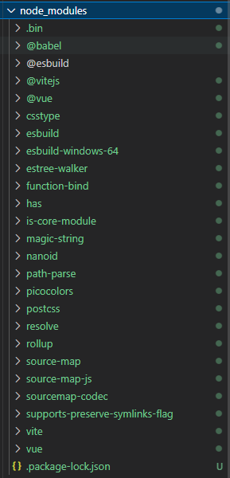
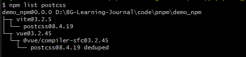
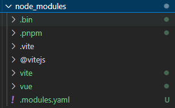
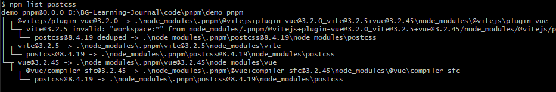

# pnpm
- <a href='#topic1'>区别与npm</a>
- 　
- 　

---

### <a id='topic1' style='text-decoration:none;'>区别与npm</a>
1.pnpm可以把依赖包存放在一个统一的位置，区别于npm独立的node_modules副本。
 
2.如果对同一依赖包需要使用不同的版本，则仅有版本之间不同的文件会被存储起来。例如，如果某个依赖包含 100 个文件，其发布了一个新版本，并且新版本中只有一个文件有修改，则 `pnpm update` 只需要添加一个新文件到存储中，而不会因为一个文件的修改而保存依赖包的所有文件。
 
3.就单项目而言，pnpm下载的依赖包结构不会和npm下载的一样将所有依赖提升到 node_modules 的 根目录下，而是仅将项目的直接依赖项添加到 node_modules 的根目录下，其余的由`.pnpm`文件夹管理。
 
npm下载

 
npm根目录追溯postcss依赖

 
pnpm下载

 
pnpm根目录追溯postcss依赖

